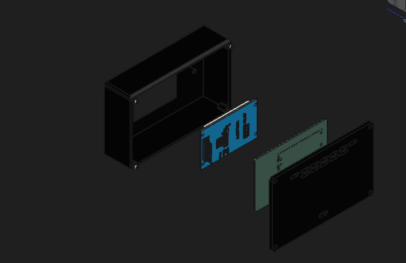
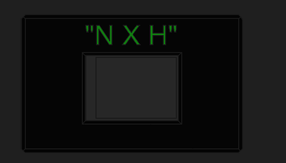
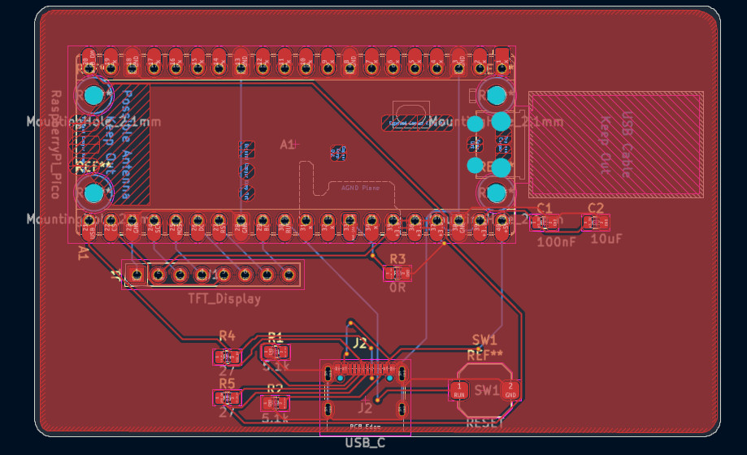
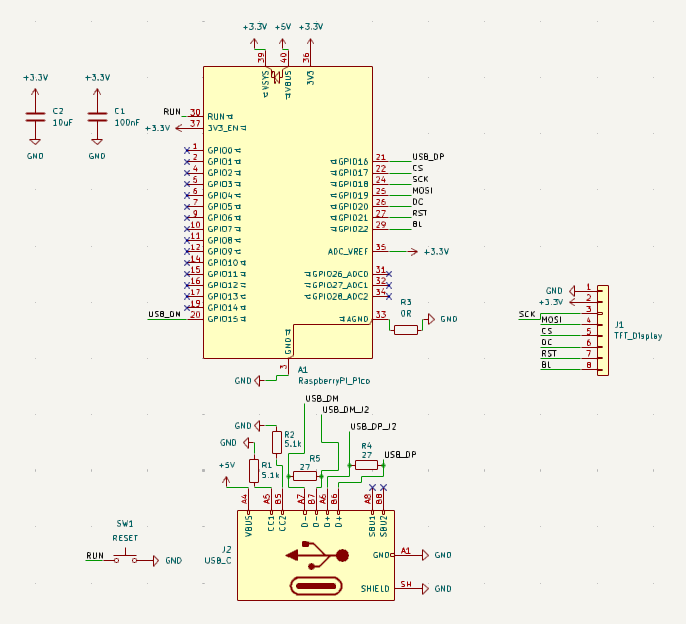
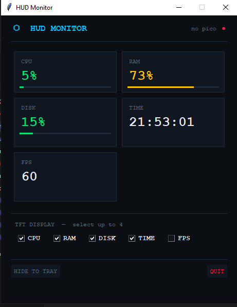
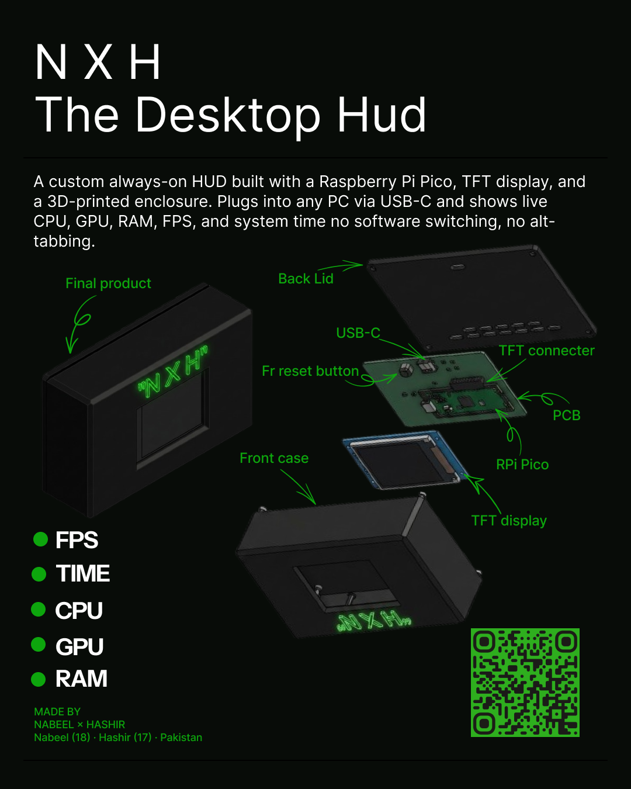

# N X H — The Desktop HUD

     

> A always-on hardware HUD that sits on ur desk and shows live CPU, RAM, DISK, FPS and TIME — no alt-tabbing, no task manager, just plug and go.


---

## What is it?

NXH is a compact always-on HUD built around the Raspberry Pi Pico. It plugs into any PC via USB-C and shows live system stats CPU usage, RAM, disk, FPS, and time on a 2.4" ST7789V TFT display (240×320, SPI). The whole thing sits in a custom 3D-printed enclosure I designed in FreeCAD. No software window to manage, no hotkeys, it is just always there on ur desk showing you what ur PC is doing.

## Why I built it

My PC isn't that powerful tbh. Whenever I push it on gaming, rendering, compiling I always needed to know if it's hitting the limit. Opening task manager takes too long and gets in the way. I wanted something that just *sits there* and tells me. So I built it. Hack Club gave me the chance to actually do it for real, with a proper PCB and everything. Huge shout out to them 🙌

---

## Demo


<p align="center">
  
  
</p>

<p align="center">
  
  
</p>

<p align="center">
  
</p>

---

## Features

- Raspberry Pi Pico (RP2040) as the main MCU
- 2.4" ST7789V TFT display  240×320, SPI, 3.3V
- USB-C connectivity (power + data, no drivers needed)
- Custom 2-layer PCB designed from scratch in KiCad
- 3D-printed enclosure designed in FreeCAD back lid, front panel, internal mounts
- C++ firmware running on the Pico
- Lightweight companion desktop app (Python) select which stats to display
- Hardware reset button (SW1) wired to RUN pin
- Onboard decoupling capacitors on the 3.3V rail (100nF + 10µF)
- Displays: CPU %, RAM %, Disk %, FPS, System Time

---

## Hardware

| Component | Spec | Qty | Price | Link |
|---|---|---|---|---|
| Raspberry Pi Pico | RP2040, 2MB flash — must be original with TP1/TP2/TP3 test pads | ×1 | $3.53 | [Buy](https://www.aliexpress.com/item/1005008948799927.html) |
| 2.4" TFT Display | ST7789V driver, 240×320, SPI, 8-pin, 3.3V | ×1 | $4.47 | [Buy](https://www.aliexpress.com/item/1005009546154656.html) |
| USB-C Connector | Female SMD 16-pin, horizontal mount, USB 2.0 — GCT USB4105-GF-A footprint | ×1 (pack of 5) | $1.17 | [Buy](https://www.aliexpress.com/item/1005008515699009.html) |
| Resistor 5.1kΩ 0805 | R1, R2 — CC1/CC2 USB-C pull-downs | ×2 (pack of 100) | $1.72 | [Buy](https://www.aliexpress.com/item/1005009613956367.html) |
| Resistor 27Ω 0805 | R4, R5 — USB D+/D− series resistors | ×2 (pack of 100) | $0.46 | [Buy](https://www.aliexpress.com/item/32997835881.html) |
| Resistor 0Ω 0805 | R3 — AGND to GND bridge jumper | ×1 (pack of 100) | $0.71 | [Buy](https://www.aliexpress.com/item/1005007446894308.html) |
| Capacitor 100nF 0805 | C1 — 3.3V rail decoupling, 50V X7R ceramic | ×1 (pack of 100) | $6.11 | [Buy](https://www.aliexpress.com/item/1005012084340996.html) |
| Capacitor 10µF 0805 | C2 — 3.3V rail bulk cap, 10V X5R ceramic | ×1 (pack of 50) | $2.30 | [Buy](https://www.aliexpress.com/item/32911735940.html) |
| Tactile Push Button | 6×6mm SMD 4-pin, 4.3mm height — SW1 reset | ×1 (pack of 20) | $1.95 | [Buy](https://www.aliexpress.com/item/1005006870418414.html) |
| Male Pin Header 2.54mm | Single row 40-pin (snap to 8) — J1 TFT connector | ×1 | $0.90 | [Buy](https://www.aliexpress.com/item/32670970932.html) |
| PCB Manufacturing | 2-layer, FR-4, 1.6mm, HASL — upload Gerber to JLCPCB | ×5 boards | $3.00 | [JLCPCB](https://jlcpcb.com) |
| 3D Enclosure | Custom HUD case — upload STL to JLC3DP | ×1 | $16.78 | [JLC3DP](https://jlc3dp.com) |
| M2 × 6mm Screw + Nut | Stainless steel — 4 sets mount PCB and Pico to case posts | ×4 sets (kit of 50) | $0.30 | [Buy](https://www.aliexpress.com/item/1005003157957734.html) |
| M3 × 10mm Screw + Nut | Stainless steel — 4 sets close the back lid | ×4 sets (kit of 50) | $0.30 | [Buy](https://www.aliexpress.com/item/1005003157957734.html) |
| USB-A to USB-C Cable | 1m, data + power capable (not charge-only) | ×1 | $1.90 | [Buy](https://www.aliexpress.com/item/1005006121990031.html) |
| USB-C Extension Cable | USB-C 3.1 Gen2, PD 100W, 5A — optional if ur port is hard to reach | ×1 | $2.42 | [Buy](https://www.aliexpress.com/item/1005006904002741.html) |

[`BOM components.csv`](BOM%20components.csv)

---

## How to use

## Build & Installation Guide

### Parts needed
See full BOM table above with links.

### PCB Assembly
1. Order PCB using gerbers.zip from JLCPCB
2. Solder SMD components first: R1, R2 (5.1k), R3 (0Ω), R4, R5 (27Ω), C1 (100nF), C2 (10uF), SW1
3. Solder USB-C connector J2
4. Place Raspberry Pi Pico on pin headers
5. Connect TFT display to J1 connector

### Flash Firmware
1. Hold BOOTSEL on Pico and plug USB-C
2. Copy FIRMWARE/hud-firmware/SRC/main.cpp compiled .uf2 to the drive
3. Pico reboots automatically

### Run the companion app

1. Make sure Python is installed — if not, [download it here](https://python.org)
2. Install dependencies:
   ```
   pip install -r app/requirements.txt
   ```
3. Run the app:
   ```
   python app/main.py
   ```
4. The HUD Monitor window opens — tick which stats you want shown on the display (CPU, RAM, DISK, TIME, FPS)
5. The device updates in real time as long as it's connected

> The app talks to the Pico over serial (USB). If it says "no pico" in the top right, unplug and replug the USB-C cable.

---

## Repo structure

```
NXH/
├── README.md
├── BOM components.csv
│
├── APP/
│   └── hud-app/
│       ├── main.py
│       ├── config.py
│       ├── metrics.py
│       ├── tray.py
│       ├── hud_settings.json
│       └── core/
│           ├── formatter.py
│           ├── metrics.py
│           ├── sender.py
│           └── __init__.py
│
├── ASSETS/
│   ├── banner.png
│   ├── exploded.png
│   ├── front.png
│   ├── pcb.png
│   ├── schematic.png
│   ├── app-screenshot.png
│   ├── wiring.png
│   └── zine-page.png
│
├── CAD/
│   ├── HUD case neww.FCStd          ← FreeCAD source
│   ├── HUD case new.step            ← full assembly export
│   ├── PCB new.step                 ← PCB 3D model
│   └── Display TFT-ST7789-240X320 V2.step
│
├── FIRMWARE/
│   └── hud-firmware/
│       ├── platformio.ini
│       └── SRC/
│           └── main.cpp
│
└── PCB/
    ├── gerber new.zip               ← submit this to JLCPCB
    └── PCB new/
        ├── real PCB.kicad_pro
        ├── real PCB.kicad_sch
        └── real PCB.kicad_pcb
```
---

## Wiring diagram

<p align="center">
  
</p>

| Pico pin | TFT pin | Signal |
|---|---|---|
| GP17 | CS | Chip select |
| GP18 | SCK | SPI clock |
| GP19 | MOSI | SPI data |
| GP20 | DC | Data/command |
| GP21 | RST | Reset |
| GP22 | BL | Backlight |
| 3V3 (pin 36) | VCC | 3.3V power |
| GND (pin 38) | GND | Ground |

---


## Zine page

*Made for Hack Club Fallout — Shenzhen 2025*

<p align="center">
  
</p>

---

## Credits

- [KiCad](https://www.kicad.org/) — PCB design and schematic
- [FreeCAD](https://www.freecad.org/) — 3D enclosure design
- [Hack Club Fallout](https://fallout.hackclub.com) — grant program that made this real
- Python + psutil — companion app backend

Made with love by **Nabeel (18) × Hashir (17)** — Pakistan 🇵🇰

---

## License

This project is licensed under the [MIT License](LICENSE).
